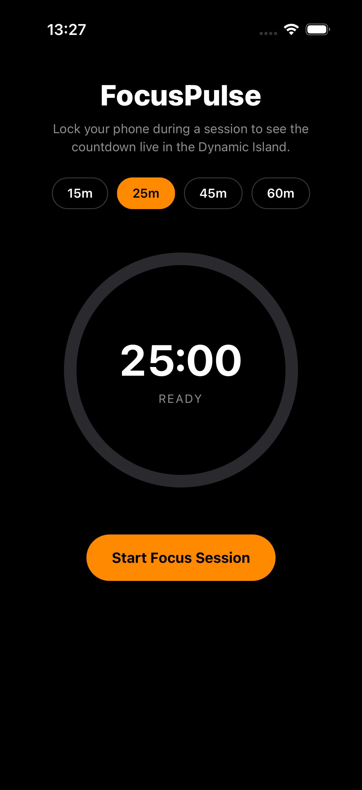
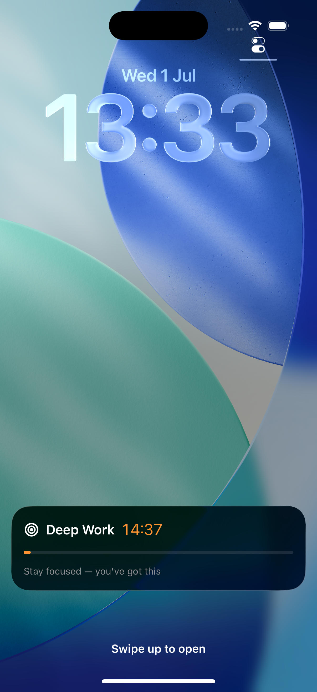

# FocusPulse

A focus/Pomodoro timer for iOS built with **React Native CLI** (bare, new architecture) that
drives a real native **ActivityKit Live Activity** — the countdown shows up in the **Dynamic
Island** and on the **Lock Screen**, ticking natively even while the JS thread is idle,
backgrounded, or the app is fully suspended.

<p align="center">
  
  
</p>

## Why this exists

Most React Native portfolio apps stop at "calls an API, renders a list." This one demonstrates
the parts of the stack that don't come for free in RN: writing a custom native module, bridging
it cleanly to JS, and driving an iOS-only system surface (Dynamic Island / Live Activities) that
has no cross-platform equivalent.

## How it works

```
React Native (TypeScript)          Native iOS (Swift)
┌─────────────────────┐            ┌──────────────────────────┐
│ useFocusTimer hook   │──bridge──▶│ LiveActivityModule.swift  │
│ (start/pause/resume) │           │  Activity.request/update  │
└─────────────────────┘            └──────────────┬────────────┘
                                                    │ ContentState
                                                    ▼
                                     ┌──────────────────────────┐
                                     │ FocusPulseWidgetExtension │
                                     │ SwiftUI Live Activity UI  │
                                     │ (Lock Screen + Dynamic    │
                                     │  Island: compact/         │
                                     │  expanded/minimal)        │
                                     └──────────────────────────┘
```

- **`src/native/LiveActivity.ts`** — typed wrapper around the native module (`start`, `update`, `end`).
- **`src/hooks/useFocusTimer.ts`** — the timer state machine. It only calls into native on state
  *transitions* (start/pause/resume/end) — never every second. The countdown itself is rendered by
  `Text(timerInterval:)` / `ProgressView(timerInterval:)` in SwiftUI, which ticks on the system's own
  clock with zero ongoing JS or CPU cost.
- **`ios/FocusPulse/LiveActivityModule.swift` + `.m`** — a classic `RCTBridgeModule` (works fine
  under the New Architecture via the interop layer) that starts/updates/ends the `Activity`.
- **`ios/FocusPulseShared/FocusSessionAttributes.swift`** — the `ActivityAttributes` /
  `ContentState` shape, compiled into *both* the app and the widget extension targets.
- **`ios/FocusPulseWidget/`** — the Widget Extension target (added programmatically via the
  `xcodeproj` Ruby gem — see below) containing the Live Activity's SwiftUI views.

## Notable engineering details (for interviews)

- **New target added via script, not Xcode UI.** `FocusPulseWidgetExtension` was created with a
  Ruby script using the `xcodeproj` gem (`project.new_target(:app_extension, ...)`), then wired up
  with an "Embed Foundation Extensions" copy-files build phase and a target dependency — the same
  technique tools like Fastlane use to manipulate `.pbxproj` files reproducibly.
- **Progress bar anchoring bug, found and fixed during testing:** an early version computed the
  Dynamic Island progress bar's range as `Date.now...endDate`, which silently reset to 0% any time
  SwiftUI re-evaluated the view (e.g. on lock/unlock), because `Date.now` was re-captured at render
  time. Fixed by anchoring to `endDate.addingTimeInterval(-totalDuration)`, a value derived purely
  from stable state, so the progress bar is correct across re-renders and across pause/resume
  cycles.
- **No App Group needed.** Unlike Home Screen widgets (WidgetKit timelines), a single-process Live
  Activity doesn't need shared UserDefaults/App Groups — state flows through
  `Activity.request`/`.update` directly, which keeps the setup simpler.
- **Deployment target is iOS 16.2**, the minimum for `Activity.request(attributes:content:pushType:)`.

## Requirements

- Xcode 15+, iOS 16.2+ simulator or device with Dynamic Island (iPhone 14 Pro or later)
- CocoaPods (`bundle install && bundle exec pod install` in `ios/`)

## Running it

```sh
npm install
cd ios && bundle install && bundle exec pod install && cd ..
npm start        # Metro
npm run ios      # builds & launches on the simulator
```

To see the Live Activity: tap **Start Focus Session**, then lock the device/simulator
(`Cmd+L` in Simulator) or swipe to the Lock Screen. Long-press the Dynamic Island to see the
expanded view.
